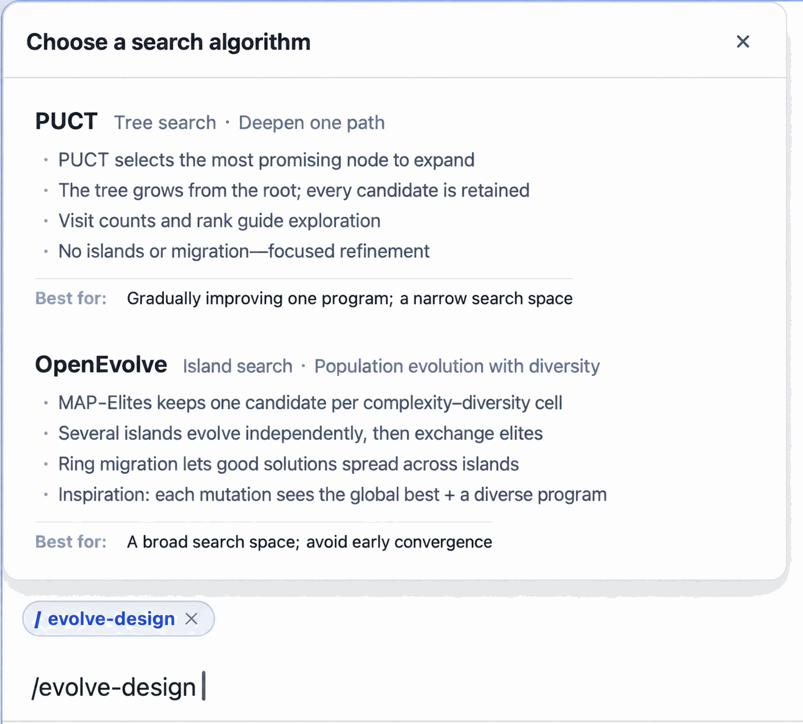
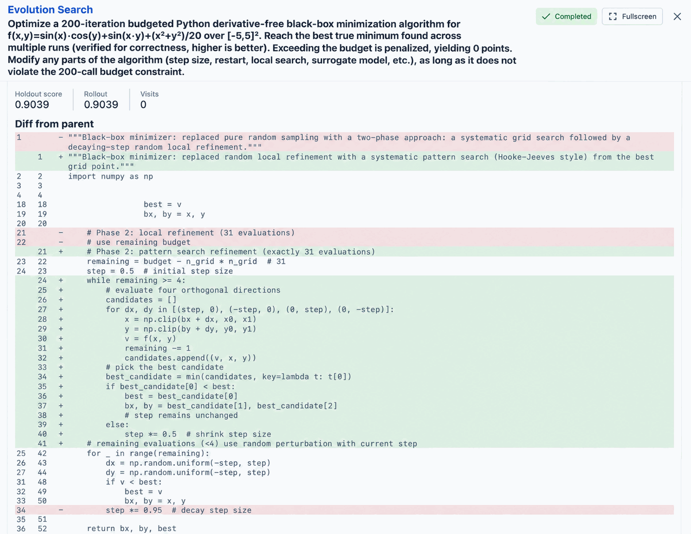

# RSI for scientific artifacts: put each improvement to the test

Once an algorithm works, can it become faster, more accurate, or smaller? Once a proposal exists, can clear criteria guide its improvement? RSI for scientific artifacts turns repeated revision and evaluation into a recorded search process.

In ScienceDiscovery, start this workflow with `/evolve-design`. It improves a program or another evaluable text artifact; it does not train or update model weights. You define “better,” and the system generates variants, scores them, retains useful candidates, and checks the result on held-out data.

## Find a useful measure first

Search can generate code repeatedly, but evaluation tells it which changes deserve to survive. A text compressor, for example, must recover the original input exactly before earning credit for fewer bytes. Rewarding small output alone could favor throwing the input away.

Evaluation can use dataset metrics, test suites, custom scripts, or model judging. The choice depends on what you can measure. Code can run tests; a written proposal may need explicit criteria. Model judgments fluctuate and should not be treated as precise measurements.

Before launch, probes check whether evaluation distinguishes working and broken candidates and whether improvement is possible. This can expose obvious evaluation defects, but cannot guarantee that a metric fully represents the research objective.

## Balance refinement with exploration

PUCT organizes candidates as a tree, distributing attempts between promising branches and other directions. OpenEvolve maintains populations and an archive of different candidates, supporting exploration across multiple approaches. Both share evaluation and delivery mechanisms.

The run panel shows candidates, scores, and their relationships. Failed candidates also convey information: a proposed change did not survive evaluation. Search does not guarantee improvement on every run; keeping the seed can be a reasonable result.

## Check whether improvement carries over

Data used to compare candidates during search is separated from the final held-out test, and evaluation stays frozen within a search. This reduces the direct effect of repeated candidate selection on the final assessment.

A held-out score still describes only the chosen test data. A narrow corpus, a score ceiling reached too easily, or a metric disconnected from practical needs can limit its meaning. Read the baseline, search score, and held-out score together rather than reporting only a maximum.

## Deliver versions that support further work

When search finds an improvement, artifact versions and code differences help explain what changed. Download the result, review the evaluation, or start another search from an existing version. This incremental approach is especially useful when a working seed and a measurable objective already exist.

Idea Tree compares research directions and plans; RSI iteratively improves an evaluable artifact. They serve different research stages and do not automatically form a complete experimental pipeline.

- [PUCT compression tutorial](../domains/evolve-a-solution.md): complete a real program optimization.
- [Evolution engines and deployment](../developer-docs/evolve-standalone.md): scoring, engines, and execution design.
- [Idea Tree](idea-tree.md): explore research directions that are still open.
