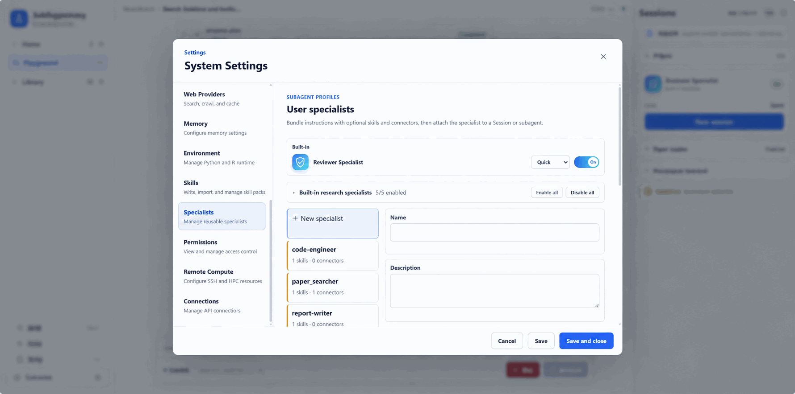

# Specialists: give research tasks focused expertise

A research report often requires several kinds of work: finding papers, extracting evidence, writing code, evaluating results, and developing an argument. Each needs different judgment. Retrieval should fill source gaps; writing should avoid adding unsupported findings. Someone implementing an analysis also benefits from a separate examination of methodology and reliability.

Specialists separate these responsibilities and supply role instructions, Skills, and tool scope. The main Agent can choose roles suited to the task while retaining responsibility for the research objective and synthesis. Researchers spend less time repeating working requirements and gain clearer assignments and deliveries.

The relationship to MCP and Skills is simple: **MCP is a tool, Skill is a method, and Specialist is a role.** A Specialist is not a new execution environment; it packages who owns a kind of work, which methods they can use, and which tools they can call.

## Preset roles are a starting point

ScienceDiscovery provides preset Specialists for literature retrieval, evidence extraction, code analysis, result evaluation, report writing, and selected material-design work. Combine them as needed; every investigation does not require a full team.

For a bird-migration review, retrieval can prepare sources, evidence extraction can preserve species and experimental conditions, and writing can synthesize the findings. Data analysis may benefit more from separating code implementation and result evaluation.

The complete preset inventory changes with releases; see [Built-in research capabilities reference](../reference/builtin-research-capabilities.md).

Preset responsibilities can be enabled or disabled. Role names do not confer professional qualifications, and several roles may share model biases. Clear assignments support inspection rather than replace validation. The workflow's `result-evaluator` is also distinct from the artifact-focused [Reviewer mechanism](science-memory-reviewer.md).

## Bring in your domain's experience

Presets cannot cover every laboratory's process. Create a Specialist that captures your research scope, decision rules, delivery requirements, and available connectors. A cohort-selection assistant, for example, could require inclusion/exclusion counts at each step and reproducible scripts.

Custom roles use the existing runtime and permission system; adding one does not require redeploying the application. If a role needs specialized tools or methods, connect MCP services or import Skills and incorporate them into the appropriate workflow.

- [Create and use custom Specialists](../advanced-setup/configure-specialists.md): define responsibilities, configure resources, and verify a task.
- [Scientific MCP and Skills](mcp-skills.md): existing tools, methods, and extension options.
- [Literature-research tutorial](../domains/literature-research.md): from a question to an inspectable report.
