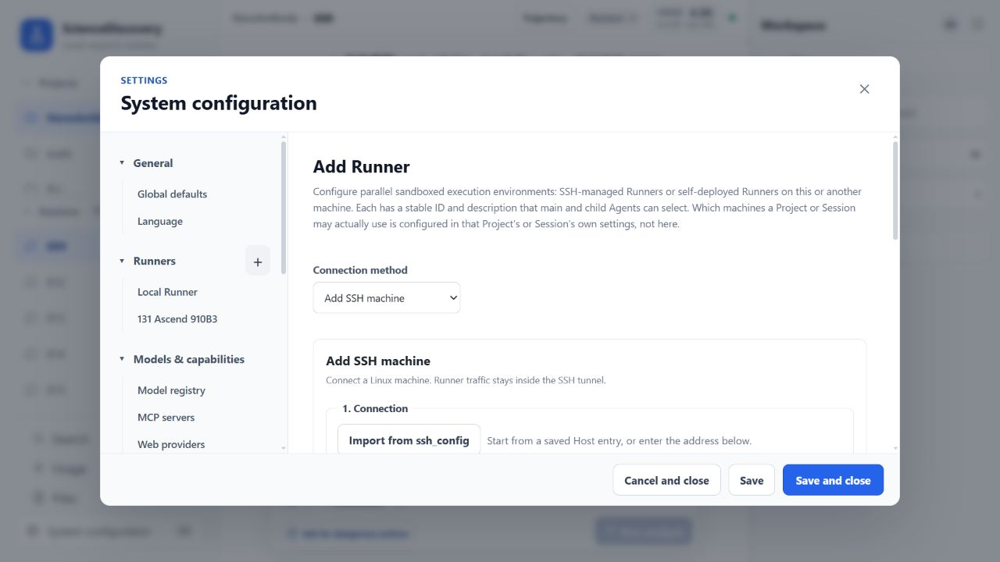
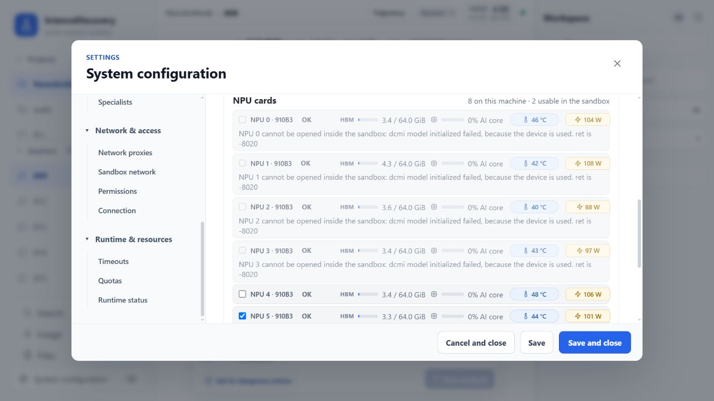
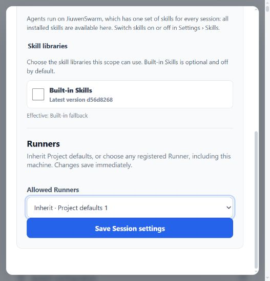
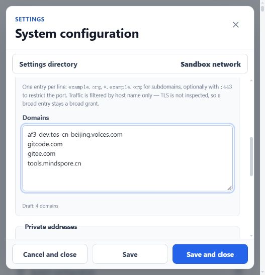
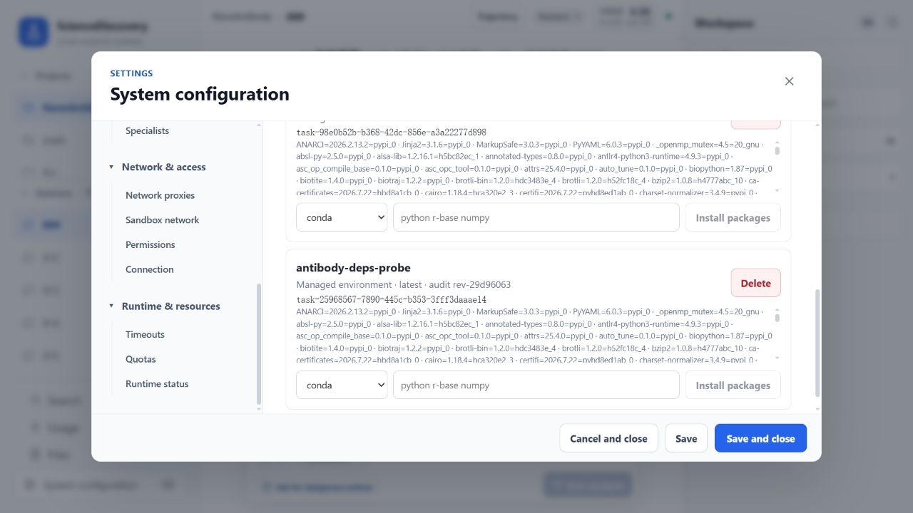
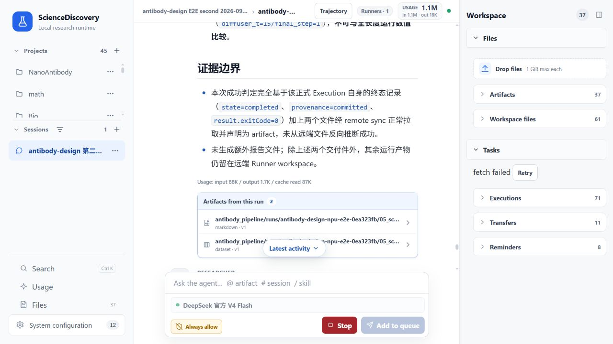
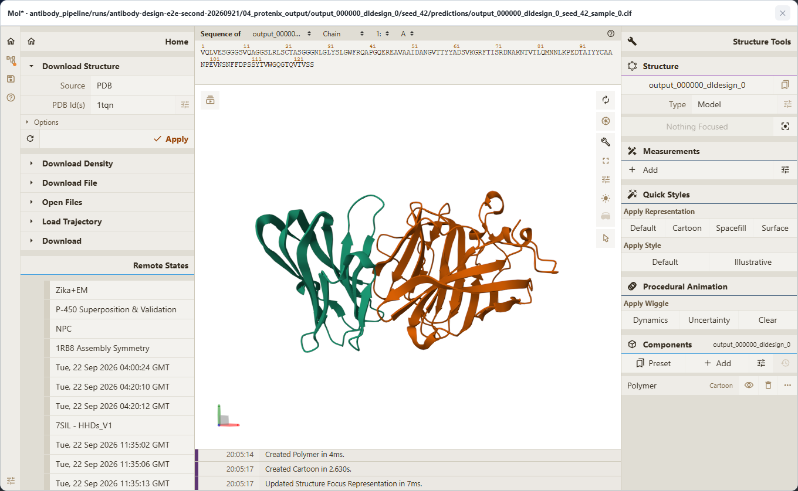

# Design an antibody on Ascend NPU

**Allow about 30 minutes to configure and run the task. First-time resource preparation and model runtime are additional.**

This tutorial shows you how to use the built-in `antibody-design` Skill to run an
RFdiffusion → ProteinMPNN → Protenix → screening antibody-design workflow on a remote
Ascend NPU Runner. At the end, you will have candidate structures, Protenix confidence results,
and Markdown/CSV reports that explain whether each candidate passed screening.

Before you begin, complete the [Quick start](../getting-started/quick-start.md) and configure a task
model. Also confirm that ScienceDiscovery passed its sandbox checks and started with sandbox
execution enabled; do not use `--skip-sandbox-check` when starting the service. You also need a
Linux machine with compatible Ascend drivers and the CANN runtime, at least one Ascend NPU, and the
SSH address and credentials for that machine. You will add and connect the Runner in this tutorial;
it does not need to be configured in advance.

## 1. Create a Project and Session

Create a Project such as `antibody-design-demo`, then create a Session in it. The Runner setup,
input upload, and task submission in the rest of this tutorial all use this Session, so keep it
open.

When using a remote Runner, the Agent automatically synchronizes missing input PDBs to its
Workspace. On the first run, the Skill also prepares the pinned model code and downloads and
verifies the required checkpoints in that same Workspace. You do not need to download or copy model
files manually.

## 2. Prepare the three scientific inputs

The pipeline does not provide a default antigen or antibody framework, and it will not guess a
binding site for you. Prepare these inputs first:

| Input | Requirement |
|---|---|
| Target-antigen PDB | Preserve the original chain names and residue numbering |
| Antibody-framework PDB | Used as the framework input for RFdiffusion |
| Hotspot list | Use residue numbers with chain names, for example `[B45,B46,B49]` |

Upload the target-antigen PDB and antibody-framework PDB to the Session you created in step 1.

Every hotspot must map to a CA atom in the target-antigen PDB. Do not enter only `45,46,49`, and do
not use numbering from the antibody framework as antigen hotspots. The Agent validates chain names
and residues before starting the models. If any input is missing, it should stop and ask you.

## 3. Add and connect a Runner

This tutorial connects to a separate Ascend Linux machine over SSH. Add the remote Runner as
follows:

1. Open **System configuration → Runners**, then click **Add Runner**.
2. Select **Add SSH machine**. Enter the SSH alias or IP/host name, port, user name, and either a
   password or private key. You can also import an existing Host entry from your local `ssh_config`.
3. Enter a name and description that help the Agent identify the Runner, such as “Ascend 910B3
   antibody design.”
4. Click **Probe and add**. If the first connection reports an unknown host key, verify the
   fingerprint with the machine administrator before clicking **Trust and continue**.
5. On the Runner card, click **Connect Runner** and wait until its status becomes **Connected**. If
   the remote machine does not yet have a Runner, ScienceDiscovery automatically deploys the
   single-file SEA Runner matching the current version. The remote machine does not need Node.js,
   and Runner traffic always travels through the SSH tunnel.



*The Add Runner screen on a real installation. Enter credentials only on the settings page; never
put passwords or private keys in a task prompt.*

The remote machine still needs Linux, a working Bubblewrap sandbox, and Ascend drivers/CANN that can
access the NPU. These are machine-level dependencies and are not installed by the Skill. If the
connection fails, open **Connection process** to inspect each step. After the connection succeeds,
use **Check connection** and **Refresh resources** to verify that the Runner version, disk, CPU,
memory, and NPU inventory are available.

### 3.1 Select NPUs for the remote Runner

In the Runner's **NPU cards** section, review the detected devices. Select only devices marked as
usable inside the sandbox, then click **Save selection**. If no NPU is reported, check the remote
driver and `npu-smi`. If a device exists but cannot be opened inside the sandbox, release the busy
device or fix its device-node/sandbox configuration before starting a model.

The host device number is not the same as the device number inside the sandbox. For example, after
host NPU 5 in the screenshot is selected by itself, it appears as NPU 0 inside the sandbox. The
Skill uses zero-based sandbox logical numbers. Let the Agent use the system selection; do not
hard-code the host device number in the pipeline configuration.



*This machine has eight detected devices, two of which can currently be opened inside the sandbox.
Only NPU 5 is selected in the screenshot, so it is renumbered from device 0 inside the sandbox.*

### 3.2 Allow the current Session to use the Runner

The machine catalog in system configuration only records that the Runner exists. Return to the
Session created in step 1, open **More actions → Settings** at the end of its row, and find the
**Runners** section. Under **Allowed Runners**, select **Override** and enable this Runner. You can
also set it as the default for new Sessions in the Project's **Runner** settings. After saving,
preparation, validation, execution, and file transfer should all continue to use the same Runner ID.



*In Session settings, Runners appears below Skill libraries. Select Override to enable the Runner
for this task.*

## 4. Allow network access for first-time resource preparation

On the first run, the Skill prepares pinned model code and weights in the current Session's Runner
Workspace. Open **System configuration → Sandbox network**, set the mode to **Domain allowlist**,
and enter one domain per line under **Allowed domains**:

- `gitcode.com`
- `gitee.com`
- `tools.mindspore.cn`
- `af3-dev.tos-cn-beijing.volces.com`



*The Domains field on the Sandbox network page is the allowlist entry point. Confirm that the mode
is Domain allowlist, then save the settings.*

The last domain provides the Protenix CCD cache. Do not switch to unrestricted networking for
convenience. Preparation verifies pinned source revisions, file sizes, and SHA-256 hashes, and uses
temporary `.part` files for atomic downloads. Later runs in the same Session reuse the verified
resources. A new Session has an independent Workspace, so it must prepare the resources again; the
current flow does not share the model cache across Sessions.

## 5. Submit the task

In the input box, state the input files, hotspots, design count, and Runner clearly. For example:

```text
Use the antibody-design Skill to run an antibody-design job on the Ascend NPU Runner authorized for
the current Session.

Target antigen: target_antigen.pdb
Antibody framework: antibody_framework.pdb
Hotspots: [B45,B46,B49]
Number of designs: 2
Run name: antibody-demo-01

Use the verified full-run parameters diffuser_t=200 and final_step=160. First check the Runner,
NPU, and all three inputs. Find a suitable managed environment; if none exists, create one and
install the Skill's requirements.txt. Then check the sandbox network allowlist, prepare resources
on first use, and run preflight validation. Submit the background pipeline exactly once, retain the
same Execution ID while monitoring it, and return the screening report, summary CSV, and candidate
structures when it finishes.
```

## 6. Checkpoint 1 — verify that the inputs match

The Agent should first report the chains available in the target PDB and the hotspot validation
result. Confirm three things:

- The target-antigen PDB and antibody-framework PDB are not reversed.
- Every hotspot includes a chain name and exists in the target PDB.
- The design count, run name, and overwrite behavior match your intent.

Reusing a run name with overwrite enabled deletes the existing stage outputs for that run. Do not
approve overwriting unless you explicitly intend to rerun it.

## 7. Checkpoint 2 — verify the environment and first-time preparation

After the task starts, the Agent searches for and validates a managed Python environment on the
selected Runner. If no environment satisfies `requirements.txt`, it creates or updates one and
continues after dependency installation. You do not need to configure this environment in settings
in advance; approve the scientific-environment change if a permission card appears. Preparation,
validation, and the model run continue to use the same environment ID, while the actual environment
revision is recorded for traceability.



*During a real run, the managed-environment card created by the Agent shows the environment name,
revision, task ID, and installed dependencies. This is a checkpoint, not a request for manual
preconfiguration.*

If environment preparation fails, use the Agent's error to check whether managed scientific
environments are enabled for the Runner, whether the package source is reachable, or whether an
administrator must provide an offline package cache. Do not manually run `pip install` or activate
a host virtual environment through `run_shell`.

First-time resource preparation is itself a managed background Shell Execution. It clones pinned
MindScience and RFdiffusion dependencies, applies the RFdiffusion MindSpore Tensor-to-PDB
compatibility patch, and downloads the official RFdiffusion, ProteinMPNN, and Protenix weights.

Keep the Execution ID for this preparation. A slow network or an expired wait does not mean the
task failed. Continue reading the status and incremental logs for the same ID instead of submitting
the preparation command again. Proceed only after the Execution reaches a completed terminal state
with exit code 0.

## 8. Checkpoint 3 — validate, then launch exactly once

Before the real run, the Agent should perform a foreground validation with the same Runner, managed
environment, and configuration. After validation passes, it submits the full pipeline exactly once
as a background Shell Execution.

Keep this new Execution ID. A normal run proceeds through these stages:

1. RFdiffusion generates backbone candidates.
2. ProteinMPNN designs candidate sequences.
3. The candidates are converted to Protenix input.
4. Protenix predicts structures and confidence values.
5. Screening summarizes interface confidence and hotspot contacts.

Do not launch models through the old Host NPU Broker, `nohup`, or a persistent kernel. Do not submit
a second run because a wait ended or the network briefly failed. The management channel can continue
to read status and logs without taking the Workspace write lock.

## 9. Watch it run

A background task normally moves through `queued` and `running`, then reaches `completed`, `failed`,
or `cancelled`. While it runs, check that:

- The Execution ID never changes.
- The five stages advance in order in the logs.
- The NPU uses its sandbox logical number, not the host physical number.
- The terminal state is `completed`, the exit code is 0, and provenance is committed.

The screenshot below comes from a smoke test that explicitly set `num_designs=1` to verify the full
workflow. With `diffuser_t=200` and `final_step=160`, it finished in about 17 minutes 20 seconds, its
four model-stage counts were **1/1/1/1**, and it produced both screening files. This is not the
default design count in the tutorial prompt. The tutorial generates 2 candidates by default, for
which the expected counts are **2/2/2/2**. Runtime varies with candidate count, available NPUs,
network, and model-cache state. Judge whether the same Execution completed the entire pipeline, not
whether an individual wait call returned promptly.



*The screenshot shows a smoke validation on the same remote Ascend Runner, including the Execution
terminal state, screening summary, and two artifact entry points. Scientific values from the smoke
parameters are not directly comparable with the full-parameter run below.*

## 10. Read the results

A successful run should contain at least:

```text
antibody_pipeline/runs/<run_name>/
  01_rfdiffusion/                 # RFdiffusion PDB
  02_proteinmpnn/                 # ProteinMPNN PDB
  03_protenix_input_json/         # Protenix input JSON
  04_protenix_output/             # Protenix CIF and confidence results
  05_screening/
    protenix_screening_report.md
    protenix_screening_summary.csv
```

This tutorial generates 2 candidates by default, so the RFdiffusion PDB, ProteinMPNN PDB, Protenix
input, and Protenix confidence-result counts should be **2/2/2/2**. If you change the number of
designs in the prompt to 4, those counts should become **4/4/4/4**. More designs generally require
more model runtime and storage. When using a remote Runner, the Agent must pull the outputs you want
to inspect into the local Session before declaring them as artifacts. Files in the remote Workspace
do not automatically appear in the artifact panel on the right.

In **Artifacts**, open the `.cif` file under `04_protenix_output`. On the **Preview** tab, click
**Open the interactive Mol* viewer**. You can rotate and zoom the Protenix prediction and inspect it
by chain directly inside ScienceDiscovery.



*The Protenix CIF from the full-parameter run is open in ScienceDiscovery's built-in Mol* viewer.
Chains use different colors, and you can select residues, switch representations, or measure the
structure.*

Open `protenix_screening_summary.csv` to compare each candidate's screening status, ipTM, pTM, and
hotspot contact row by row, then open its corresponding `.cif` file to inspect the structure. A
multi-candidate run can contain both PASS and FAIL results; one candidate missing a threshold does
not mean that the pipeline failed. For example, a candidate with `FAIL_low_interface_confidence`,
ipTM 0.275, pTM 0.375, and hotspot contact 1/3 has insufficient interface confidence but remains a
valid scientific negative result. An unmappable hotspot, missing stage files, or a non-zero
Execution exit code indicates a run failure.

## Troubleshooting

- **Download fails:** Confirm that all four domains are in the sandbox allowlist and inspect the
  original Execution logs. Do not switch to unofficial mirrors.
- **No usable environment:** Confirm that managed scientific environments are enabled for the
  Runner and approve the environment change. The Skill creates or updates an environment on the
  same Runner, then rechecks the full `requirements.txt`.
- **NPU unavailable:** Return to system configuration and confirm that the Runner detected the
  device as sandbox-usable and that the selection was saved on the Runner card.
- **Hotspot validation fails:** Use the available chains and CA residues listed in the error to fix
  the numbering. Do not ask the Agent to guess.
- **Screening result is FAIL:** If all five stages and both reports are complete, the candidate
  usually failed a scientific threshold; this is not a system failure.

## Key considerations

- The user must explicitly supply all three scientific inputs, especially chain-qualified hotspots.
- The Runner, managed environment, NPU selection, and Workspace must stay consistent throughout the
  workflow.
- First-time preparation and the model run both use managed background Executions that are monitored
  by their original IDs.
- Host NPUs are renumbered from 0 inside the sandbox.
- Pipeline completion and passing scientific screening are different outcomes; a trustworthy
  negative result is still a result.

## Contributor and feedback

- Contributor: [Yuheng Wang (@wyhohyw)](https://github.com/wyhohyw)
- Email: [wyhohyw@gmail.com](mailto:wyhohyw@gmail.com)
