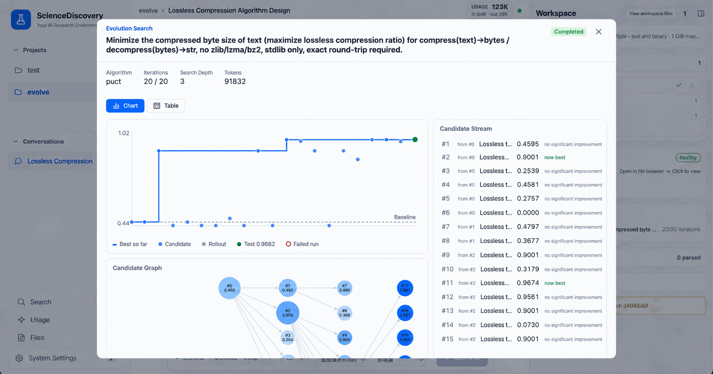

# Use PUCT to optimize a text compression algorithm

## Background

Suppose you need to store a large amount of text in smaller files while being able to recover every character. You have a working compression algorithm, but you are unsure how to improve it.

This tutorial uses that problem to introduce program evolution. The Agent first writes a simple working compressor and an evaluator. PUCT search then repeatedly modifies the code, evaluates candidates, and retains better ones. PUCT distributes attempts across different directions, improving promising approaches while exploring alternatives.

The task requires two functions: `compress(text) -> bytes` and `decompress(bytes) -> str`. Decompression must reproduce the original text exactly. The implementation may use only the Python standard library, excluding `zlib`, `lzma`, and `bz2`. Within these constraints, the goal is to reduce the number of compressed bytes.

By the end, you will have the starting code, an evaluator, the search result, and a score on held-out data that did not guide the search.

## Preparation

Complete the [quick start](../getting-started/quick-start.md), start the service, and configure an available task model. The model designs the solution and generates candidate code, so the run incurs model usage costs.

In system configuration, confirm that the Python scientific environment is ready and sandbox execution is available. Do not bypass sandbox checks with `--skip-sandbox-check`: evolution runs candidate programs in the sandbox. Scientific memory is optional and is not required for this tutorial.

You do not need to upload data. The Agent will write an evaluator that generates test texts. Allow roughly fifteen minutes for a first attempt; actual duration depends on the model, search size, and candidate execution time.

## Start the task

Create a Project and Session, then enter:

```text
/evolve-design Write a compress/decompress pair for text: compress(text) -> bytes and
decompress(bytes) -> str. The round-trip must be exact. Standard library only — no
zlib, lzma or bz2. Score is how much smaller the compressed form is.
```

Typing `/evolve-design` opens an algorithm picker. Select **PUCT**, then send the task.


You can also specify the algorithm explicitly: `/evolve-design --algorithm puct …`.

The picker also offers OpenEvolve for population-based search. This tutorial uses PUCT throughout; see [Program evolution](../core/evolve.md) for the differences between the engines.

## Confirm requirements

The Agent loads the evolution design skill and prepares the starting program, evaluation method, and search size. Review its proposal with these points in mind:

| What to check | Requirement for this tutorial |
| --- | --- |
| Input and output | Accept text, produce compressed bytes, and recover the original text |
| Correctness | Compress, decompress, and compare every test text exactly; a failed round-trip must not receive a valid compression reward |
| Implementation restrictions | Use only the standard library; the evaluator should check forbidden compression libraries rather than relying only on the prompt |
| Objective | Score the byte reduction and explain the score range, normalization, and ceiling |
| Starting point | A simple algorithm that already compresses and restores text, such as Huffman coding; it should not just return the input unchanged |
| Data | Include varied texts so that success does not depend on one repeated string |

Next, check how evaluation data is divided. You will encounter three names:

- **gate**: the scoring set used to compare candidates and guide the search.
- **rollout**: another data set used internally by the search.
- **test**: held-out data used at the end, outside candidate selection; prioritize this score when reading the final result.

For a first attempt, try **12 gate shards, 6 rollout shards, 6 test shards, 16 expansions, and 4 workers**. A shard represents a group of test texts; an expansion generates and evaluates a candidate; workers control search concurrency. This is a suggested size, not a requirement that every generated proposal be identical.

The skill defines four checkpoints for requirements, evaluation, sizing, and launch results. When the Agent pauses, confirm or request changes. To accept reasonable defaults, you can reply:

```text
You decide. Use the recommended search size from the tutorial, keep PUCT,
complete the remaining checkpoints, and start the search.
```

The model may also produce a complete proposal and launch immediately. That happened in the example run, so do not rely on it pausing at every checkpoint. If you want to review the plan yourself, include “Wait for my confirmation before starting the search” in your initial request.

Before launch, the service probes the evaluator using the working seed and deliberately broken programs, among other checks, to see whether it can distinguish good and bad candidates. If the proposal is rejected, ask the Agent to address the reported reason. The actual search has not started yet.

## Optimization process

When the Agent says the search has started, open the evolution task panel in the session. Search runs in the background; closing the panel does not stop it.



Start with the baseline score, then watch whether the best score increases as candidates appear. You do not need to understand every algorithm detail. The candidate stream shows what changed, whether execution succeeded, the score, and whether the candidate became the new best version.

Some candidates will have syntax errors, fail decompression, or score lower. These attempts do not by themselves mean the whole task failed. Check that failures are recorded and that the search continues to a terminal result.

In the example run, the seed used byte-level Huffman coding. Search explored range coding, predicting bytes from preceding bytes, and repeated-sequence matching. The selected implementation combined statistics from the preceding one to three bytes with range coding.

Wait until the panel shows that search has finished. A main Agent reply saying “search started” may arrive when the background work has only just begun; it is not a completion signal.

## Analyze results

Open the result artifact and compare the starting and selected code. A search that finds an improvement saves them as two versions of the same result artifact, so you can inspect the diff and download them.


The following record comes from a real E2E run on 2026-09-25 using DeepSeek Flash, 16 expansions, and 4 workers. It took approximately 6 minutes 47 seconds from task submission to search completion:

| Metric | Result | Interpretation |
| --- | ---: | --- |
| Seed gate score | 0.5757 | Starting algorithm on the search scoring set |
| Best candidate gate score | 0.9540 | Improvement on the same scoring set |
| Best candidate test score | 0.9224 | Final algorithm on data that did not guide search |

Compare the first two values to assess improvement over the seed. Then examine the held-out test score to see whether the improvement extends beyond the search data. Here, the test score was slightly lower than the gate score but still high under this evaluator. Shards may differ in difficulty; these results do not replace validation on your own data.

**0.9224 does not mean a 92.24% reduction in file size.** The evaluator generated for this run scored each text as follows:

```text
score = clamp((1 − compressed_bytes / original_utf8_bytes) / 0.75, 0, 1)
final_score = mean of the per-text scores
```

Under this definition, a 75% reduction earns the maximum score for one text, and any larger reduction still earns only 1. Because scores are clipped before averaging, you cannot directly convert the final score into a compression ratio for the entire corpus. To measure actual space savings, inspect the original and compressed byte counts.

This formula belongs to the evaluator generated for this task; it is not a fixed PUCT formula. On another run, read the Agent's scoring explanation before interpreting the numbers.

## Caveats

- **Separate completion from quality.** A normally finished search with readable result code has completed the workflow. Scores describe whether it improved the seed and by how much. No improvement can still be a valid search outcome.
- **The example uses synthetic texts.** A high score does not imply equal performance on arbitrary files. Before practical use, test your own files for exact round-trips, compression ratio, runtime, and memory usage.
- **Check the score ceiling.** If several candidates reach the maximum, the evaluator cannot distinguish further improvements. The example's “75% reduction earns full marks” has this limitation.
- **Held-out data has limits too.** A high test score demonstrates performance on that particular unseen set, not general compression ability.
- **Distinguish failure stages.** A proposal rejected by probes, an individual failed candidate, and a failed search are different situations. Read the panel's reason before restarting the whole task because one candidate scored zero.
- **Scores vary between runs.** The Agent may generate different seeds, texts, and evaluators. Before comparing runs, verify that the evaluation definitions match; numbers from different evaluators do not directly establish which algorithm is better.

## Related documentation

- [Quick start](../getting-started/quick-start.md): start the service, configure a model, and create a session.
- [Program evolution](../core/evolve.md): search engines, data shards, and frozen evaluators.
- [Sandbox execution](../developer-docs/sandbox-execution.md): the candidate execution environment.
