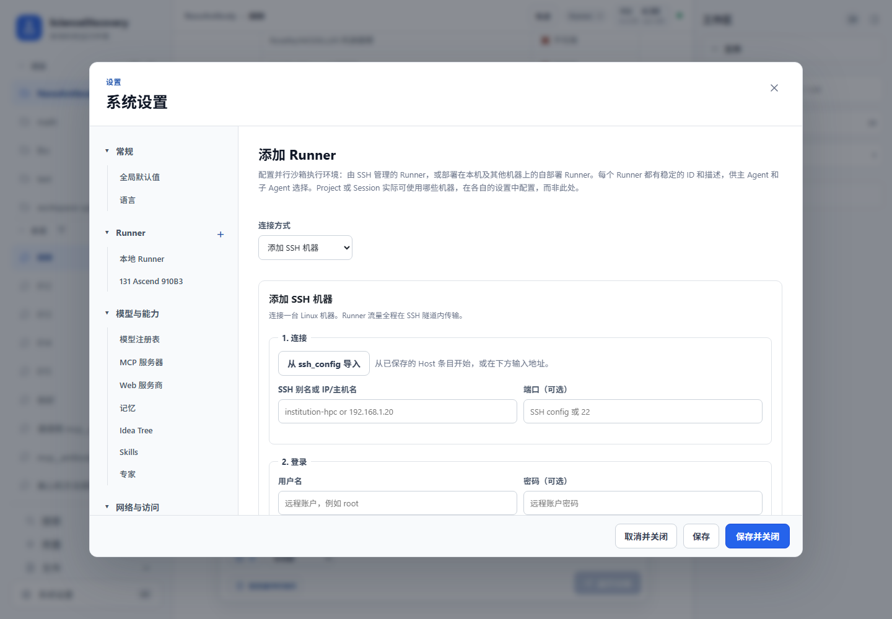
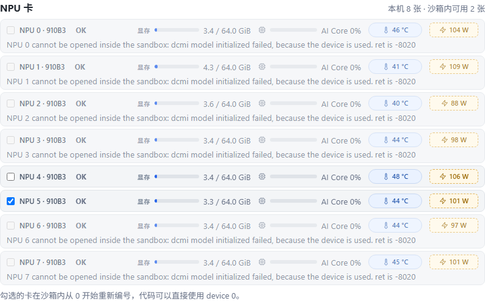
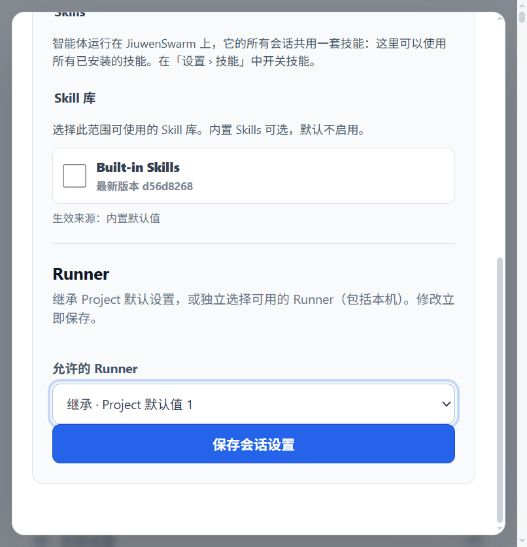
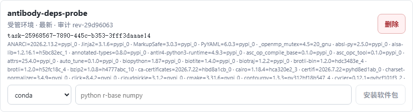
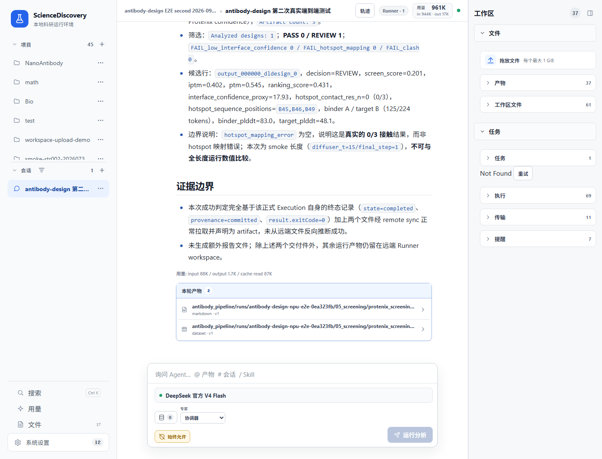

# 在 Ascend NPU 上设计抗体

**大约需要你 30 分钟完成配置与执行，首次资源准备和模型运行时间另计。**

本教程带你使用内置的 `antibody-design` Skill，在远程 Ascend NPU Runner 上完成一次
RFdiffusion → ProteinMPNN → Protenix → screening 抗体设计。结束时你会得到候选结构、
Protenix 置信度结果，以及一份说明候选是否通过筛选的 Markdown/CSV 报告。

开始之前：先完成[快速开始](../getting-started/quick-start.md)并配置任务模型；同时确认 ScienceDiscovery
已经通过沙箱检查并启用了沙箱执行，启动服务时不要使用 `--skip-sandbox-check`。你还需要一台装有兼容
Ascend 驱动和 CANN 运行时的 Linux 机器、至少一张 Ascend NPU，以及登录这台机器的 SSH 地址与凭据。
Runner 会在下面的教程步骤中添加和连接，不要求事先配置好。

## 1. 创建 Project 与 Session

新建一个 Project，例如 `antibody-design-demo`，再在其中创建一个 Session。本教程后续的 Runner 配置、
输入文件上传和任务下发都以这个 Session 为准，之后保持当前 Session 打开。

使用远程 Runner 时，Agent 会把缺失的输入 PDB 自动同步到远程 Workspace。首次运行时，Skill 还会在同一
Workspace 中自动准备固定版本的模型代码，下载并校验所需权重；用户不需要手动下载或复制模型文件。

## 2. 准备三个科学输入

这条流水线没有默认抗原、默认抗体骨架，也不会替你猜结合位点。请先准备：

| 输入 | 要求 |
|---|---|
| 目标抗原 PDB | 保留原始链名和残基编号 |
| 抗体骨架 PDB | 用作 RFdiffusion 的骨架输入 |
| hotspot 列表 | 使用带链名的残基编号，例如 `[B45,B46,B49]` |

把目标抗原 PDB 和抗体骨架 PDB 上传到第 1 步创建的 Session。

hotspot 必须能在目标抗原 PDB 中找到对应的 CA 原子。不要只写 `45,46,49`，也不要把抗体骨架上的编号
当成抗原 hotspot。Agent 会在模型启动前校验链名与残基；如果缺少任一输入，它应当停下来向你询问。

## 3. 添加并连接 Runner

本教程以通过 SSH 连接另一台 Ascend Linux 机器为例。按下面的步骤添加远程 Runner：

1. 打开 **系统设置 → Runner**，点击 **添加 Runner**。
2. 选择 **添加 SSH 机器**。填写 SSH 别名或 IP/主机名、端口、用户名，以及密码或私钥；也可以从本机
   `ssh_config` 导入已有的 Host 条目。
3. 填写便于 Agent 识别的 Runner 名称和描述，例如“Ascend 910B3 抗体设计”。
4. 点击 **探测并添加**。第一次连接如果提示“未知主机密钥”，先向机器管理员核对指纹，再点击
   **信任并继续**。
5. 在 Runner 卡片中点击 **连接 Runner**，等待状态变为**已连接**。如果远端还没有 Runner，
   ScienceDiscovery 会自动部署与当前版本匹配的单文件 SEA Runner，远端不需要预装 Node.js；Runner 流量
   始终走 SSH 隧道。



*添加 Runner 的实机界面。凭据只在设置页填写，不要把密码或私钥写进任务提示词。*

远端机器仍需具备 Linux、可用的 Bubblewrap 沙箱，以及能访问 NPU 的 Ascend 驱动/CANN 运行时。这些属于
机器级依赖，不会由 Skill 安装。连接失败时打开**连接过程**查看具体步骤；连接成功后可点击**检查连接**和
**刷新资源**确认 Runner 版本、磁盘、CPU、内存和 NPU 清单均已返回。

### 3.1 为远程 Runner 选择 NPU

在这个 Runner 的 **NPU 卡**区域查看探测结果，只勾选标为“沙箱内可用”的卡，然后点击**保存勾选**。
如果没有报告 NPU，先检查远端驱动和 `npu-smi`；如果卡存在但显示无法在沙箱中打开，先释放被占用的卡或
修复设备节点/沙箱配置，不要继续启动模型。

宿主机卡号与沙箱内卡号不是一回事。比如图中的宿主机 NPU 5 被单独授权后，会在沙箱内显示为 NPU 0；
Skill 使用的是从 0 开始的沙箱逻辑编号。让 Agent 沿用系统选择即可，不要把宿主机卡号硬编码进流水线配置。



*这台实机探测到 8 张卡，其中当前有 2 张可在沙箱中打开；图中只勾选了 NPU 5，它会在沙箱内从 device 0
开始重新编号。*

### 3.2 允许当前 Session 使用 Runner

系统设置中的机器目录只说明“这台 Runner 存在”。回到第 1 步创建的 Session，在 Session 行末打开
**更多操作 → 设置**，找到 **Runners** 区域，在 **Allowed Runners** 中选择**覆盖**并勾选这台 Runner。
也可以先在 Project 设置的 **Runner** 区域把它设为新 Session 的默认 Runner。保存后，后续所有准备、校验、
运行和文件传输都应保持使用同一个 Runner ID。



*Session 设置中的 Runners 位于 Skill libraries 下方；选择 Override 后即可勾选当前任务要使用的 Runner。*

## 4. 允许首次资源准备所需的网络

第一次运行会在当前 Session 的 Runner Workspace 中准备固定版本的模型代码和权重。将沙箱网络模式设为
**域名白名单**。具体位置是 **系统设置 → 沙箱网络**；在 **允许的域名** 输入框中每行填写一个域名：

- `gitcode.com`
- `gitee.com`
- `tools.mindspore.cn`
- `af3-dev.tos-cn-beijing.volces.com`


*Sandbox network 页面中的 Domains 输入框就是白名单入口；确认模式为 Domain allowlist 后保存。*

最后一个域名用于 Protenix 的 CCD 缓存。不要为了省事改成开放网络。准备过程会校验固定源码版本、文件大小
和 SHA-256，并通过临时 `.part` 文件完成原子下载；同一 Session 内后续运行会复用已经验证的资源。
新的 Session 有独立 Workspace，因此需要重新准备，当前流程不会跨 Session 共享模型缓存。

## 5. 下发任务

在输入框中写清输入文件、hotspot、设计数量和 Runner。例如：

```text
请使用 antibody-design Skill，在当前 Session 已授权的 Ascend NPU Runner 上完成一次抗体设计。

目标抗原：target_antigen.pdb
抗体骨架：antibody_framework.pdb
hotspots：[B45,B46,B49]
设计数量：2
运行名称：antibody-demo-01

使用已经验证过的完整参数 diffuser_t=200、final_step=160。先检查 Runner、NPU 和三个输入；
查找合适的托管环境，如果没有就按 Skill 的 requirements.txt 创建并安装。然后检查沙箱网络白名单，
首次使用时完成资源准备，再做运行前校验。只提交一次后台流水线，保留同一个 Execution ID
持续监控，完成后返回筛选报告、汇总 CSV 和候选结构。
```

## 6. 检查点 1 —— 输入是否真的匹配

Agent 应先报告目标 PDB 中可用的链和 hotspot 校验结果。确认三件事：

- 目标 PDB 与抗体骨架 PDB 没有传反。
- 每个 hotspot 都包含链名，并且能在目标 PDB 中找到。
- 设计数量、运行名称和是否覆盖旧结果符合你的意图。

复用同一个运行名称并开启覆盖会删除该次运行已有的阶段输出。除非你明确要重跑，否则不要批准覆盖。

## 7. 检查点 2 —— 环境与首次准备是否完成

任务开始后，Agent 会在选定的 Runner 上查找并验证托管 Python 环境；如果没有满足
`requirements.txt` 的环境，它会自行创建或更新，并在依赖安装完成后继续。用户无需提前进入设置页配置，
只需在出现权限卡时批准科学环境变更。后续准备、校验和正式运行会一直使用同一个环境 ID，并记录实际
environment revision 供结果追溯。



*实际运行中由 Agent 创建的托管环境卡片会显示环境名称、revision、任务 ID 和已安装依赖。这里用于核对，
不是要求用户提前手工配置。*

如果环境准备失败，再根据 Agent 返回的错误检查 Runner 是否启用了托管科学环境、软件源是否可达，或是否
需要管理员提供离线包缓存。不要在 `run_shell` 中手工 `pip install` 或激活宿主机虚拟环境。

首次资源准备本身是一条受管理的后台 Shell Execution。它会拉取固定版本的 MindScience 和 RFdiffusion
依赖、应用 RFdiffusion 的 MindSpore Tensor-to-PDB 兼容补丁，并下载 RFdiffusion、ProteinMPNN 和
Protenix 的官方权重。

记住这次准备的 Execution ID。网络慢或等待超时不代表任务已经失败；先继续查看同一个 ID 的状态和增量
日志，不要再次提交准备命令。只有终态为完成、退出码为 0，才进入下一步。

## 8. 检查点 3 —— 校验后只启动一次

正式启动前，Agent 应使用相同 Runner、相同托管环境和同一份配置执行一次前台校验。校验通过后，再把完整
流水线作为一条后台 Shell Execution 提交一次。

这里最重要的是记住新的 Execution ID。一次正常运行会依次经过：

1. RFdiffusion 生成骨架候选。
2. ProteinMPNN 设计候选序列。
3. 转换为 Protenix 输入。
4. Protenix 预测结构并给出置信度。
5. screening 汇总界面置信度和 hotspot 接触情况。

不要使用旧的 Host NPU Broker、`nohup` 或持久 kernel 启动模型，也不要因为等待结束或网络抖动就提交
第二次。管理通道可以在不占用 Workspace 写锁的情况下继续读取状态和日志。

## 9. 看着它跑

后台任务通常会显示 `queued`、`running`，最后进入 `completed`、`failed` 或 `cancelled`。运行中重点看：

- Execution ID 是否始终不变。
- 日志中的五个阶段是否按顺序推进。
- NPU 是否使用沙箱逻辑编号，而不是宿主机物理编号。
- 终态是否为 `completed`，退出码是否为 0，provenance 是否已经提交。

下面截图对应一次用于验证完整链路的 smoke test，因此明确设置了 `num_designs=1`。它使用
`diffuser_t=200`、`final_step=160`，约 17 分 20 秒完成，四类模型阶段计数为 **1/1/1/1**，并生成了两份
screening 文件；这不是本教程提示词中的默认设计数量。本教程默认生成 2 个候选，正常应看到
**2/2/2/2**。你的耗时会随候选数量、可用 NPU、网络和模型缓存状态变化；需要判断的是同一条 Execution
是否完整走完，而不是某一次等待有没有及时返回。



*图中是同一远程 Ascend Runner 上的一次 smoke 验证，用来展示 Execution 终态、筛选摘要和两份产物入口；
smoke 参数的科学数值不能与下面的完整参数运行直接比较。*

## 10. 读结果

成功运行至少应包含以下结果：

```text
antibody_pipeline/runs/<run_name>/
  01_rfdiffusion/                 # RFdiffusion PDB
  02_proteinmpnn/                 # ProteinMPNN PDB
  03_protenix_input_json/         # Protenix 输入 JSON
  04_protenix_output/             # Protenix CIF 与置信度结果
  05_screening/
    protenix_screening_report.md
    protenix_screening_summary.csv
```

本教程默认生成 2 个候选，因此 RFdiffusion PDB、ProteinMPNN PDB、Protenix 输入和 Protenix 置信度结果
应分别得到 **2/2/2/2**；把提示词中的设计数量改为 4 时，四类计数应相应变成 **4/4/4/4**。设计数量越多，
模型运行时间和存储占用通常也越大。使用远程 Runner 时，Agent 需要先把你要查看的输出拉回本地 Session，
再声明为产物；远程 Workspace 中的文件不会自动出现在右侧产物栏。

在右侧**产物**中打开 `04_protenix_output` 下的 `.cif` 文件，进入**预览**后点击 **Open the interactive
Mol* viewer**，就能直接在 ScienceDiscovery 中旋转、缩放并按链查看 Protenix 预测结构。


*完整参数实机运行生成的 Protenix CIF 已在 ScienceDiscovery 内置 Mol* 查看器中打开；图中以不同颜色显示
复合物中的链，可以继续选择残基、切换表示方式或测量结构。*

打开 `protenix_screening_summary.csv` 可以按候选逐行比较筛选状态、ipTM、pTM 和 hotspot contact，再打开
对应的 `.cif` 查看结构。多个候选可以同时出现 PASS 和 FAIL；单个候选没有通过阈值，不代表整条流水线失败。
例如某个候选得到 `FAIL_low_interface_confidence`、ipTM 0.275、pTM 0.375、hotspot contact 1/3，表示它的
界面置信度不足，是有效的科学负结果。相反，hotspot 无法映射、阶段文件缺失或 Execution 非零退出才是
运行失败。

## 常见问题

- **下载失败**：检查四个域名是否都在沙箱白名单中，并查看原 Execution 日志；不要换非官方镜像。
- **没有可用环境**：确认 Runner 的托管科学环境已开启并批准环境变更；Skill 会在同一 Runner 上创建或更新
  环境，再按完整 `requirements.txt` 复检。
- **NPU 不可用**：回到系统设置确认卡已被 Runner 探测为 sandbox-usable，并已在 Runner 卡片中保存勾选。
- **hotspot 校验失败**：使用错误信息列出的可用链与 CA 残基修正编号，不要让 Agent 自动猜测。
- **筛选结果为 FAIL**：只要五个阶段和两份报告完整，这通常是候选未过科学阈值，不是系统故障。

## 使用注意事项

- 三个科学输入必须由用户明确提供，尤其是带链名的 hotspot。
- Runner、托管环境、NPU 选择和 Workspace 必须在整条流程中保持一致。
- 首次准备、正式运行都通过受管理的后台 Execution 完成，并始终按原 ID 监控。
- 宿主机 NPU 会在沙箱内重新从 0 编号。
- 模型流水线完成与候选通过科学筛选是两件不同的事；可信的负结果仍然是结果。

## 贡献者与反馈

- 贡献者：[Yuheng Wang（@wyhohyw）](https://github.com/wyhohyw)
- 邮箱：[wyhohyw@gmail.com](mailto:wyhohyw@gmail.com)
